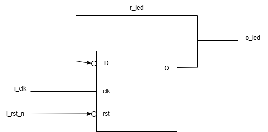
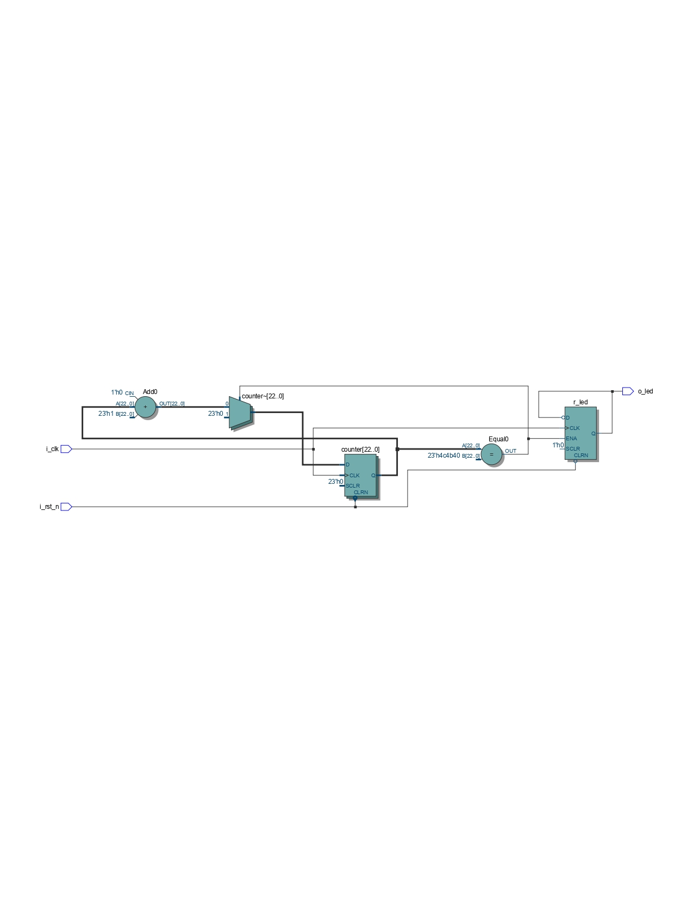
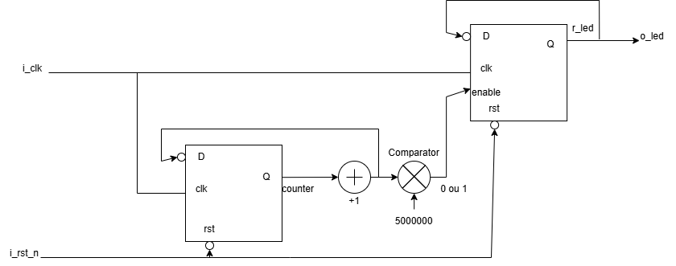
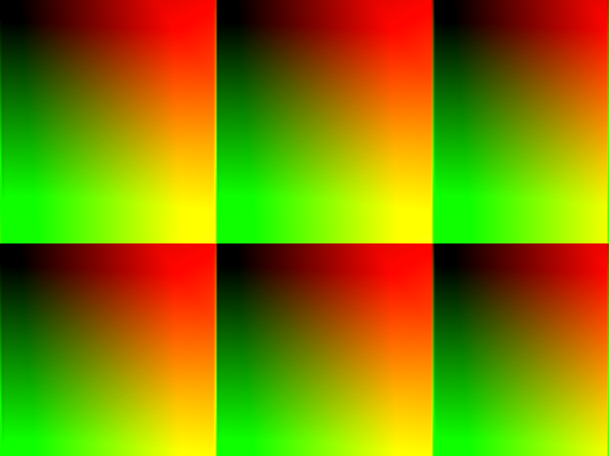
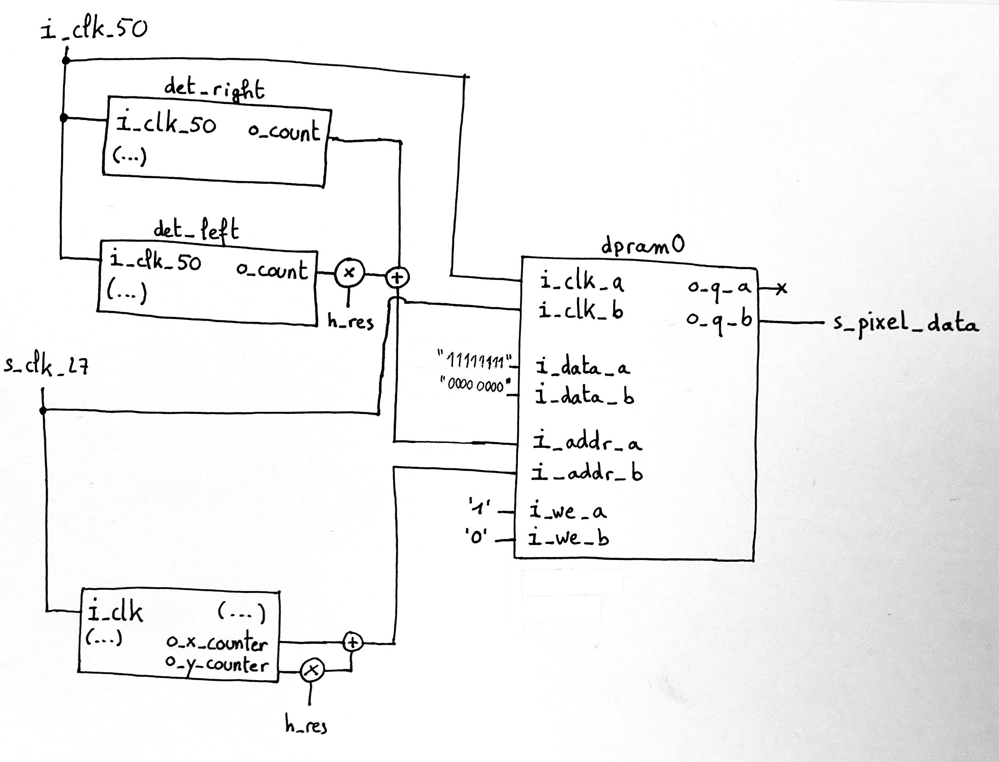

# 2526_DTI_2501_FPGA_TP_AMINE_MENPIOT


### Initialisation du projet

Pour les parties "Création d'un projet", "Création d'un fichier VHDL" et "Fichier de contraintes", on suit simplement le protocole fourni dans le sujet

### Compilation et programmation de la carte

10) On inverse simplement le comportement en ajoutant `not()` autour de `pushl` dans l’architecture. 

### Faire clignoter une DEL

1) L'horloge nommée `FPGA_CLK1_50` est connectée sur la broche `V11`

3) 

4) 

Pour faire clignoter la led en générant le signal o_led, on utilise une bascule D. Sa sortie bascule entre 0 et 1 en fonction de la fréquence d’horloge.
Dans les grandes lignes, les schémas sont identiques. Cependant, on remarque la présence de SCLR, que nous n’avons pas pris en compte

7) 

8) 

Le schéma fourni par Quartus est assez similaire au nôtre mais il contient un multiplexeur que nous n’avons pas pris en compte.

11) `i_rst_n`  : ` _n` pour "not", en effet le reset a lieu lorsque l'input vaut `'0'`


## Petit projet : écran magique

### Gestion des encodeurs

2)

Grâce à l’enchaînement de bascules D, on a accès à deux valeurs consécutives de `A`. Si on observe une variation (`A(n) != A(n+1)`, soit `A xor A_p = '1'`), alors il y a un front. De plus, en observant la valeur la plus récente, on peut déterminer s’il s’agit d’un front montant ou descendant.

### Contrôleur HDMI

5) A quels bits correspondent chaque couleur ?

RVB

On observe un quadrillage dû au dépassement de variable lorsque `s_x_counter` ou `s_y_counter`  dépassent 255.\
Le rouge dépend de la variable x, le vert de la variable y et le bleu reste à 0.

Le rouge est donc codé sur les bits 23 à 16, le vert sur les bits 15 à 8, le bleu sur les bits 7 à 0.

6) 

### Mémorisation

1) 

Une mémoire dual-port est une mémoire qui permet d'accéder à un emplacement mémoire via deux ports différents.\
On peut par exemple réaliser une opération d'écriture et une de lecture au même emplacement, sous réserve de synchronisation.

2)

Pour mémoriser les pixels, on entre `"11111111"` à l’emplacement mémoire correspondant aux coordonnées x y, plutôt que d’afficher directement ce pixel en blanc 




### Effacement

On relie l’écriture dans la RAM au bouton gauche de l’encodeur, en se rappelant qu’il renvoie `'1'` au repos : 
```
dpram0 : component dpram
generic map(...)
port map(
	…
i_we_a => i_left_pb,
i_we_b => not(i_left_pb),
… 
);
```
Ainsi, lorsque l’on appuie sur l’encodeur gauche, l’écriture du pixel blanc aux coordonnées de l’encodeur est stoppé, et les signaux `s_x_counter` et `s_y_counter` parcourant la mémoire pour l’envoyer à l’HDMI écrivent des `"00000000"`, effaçant tout les pixels.

